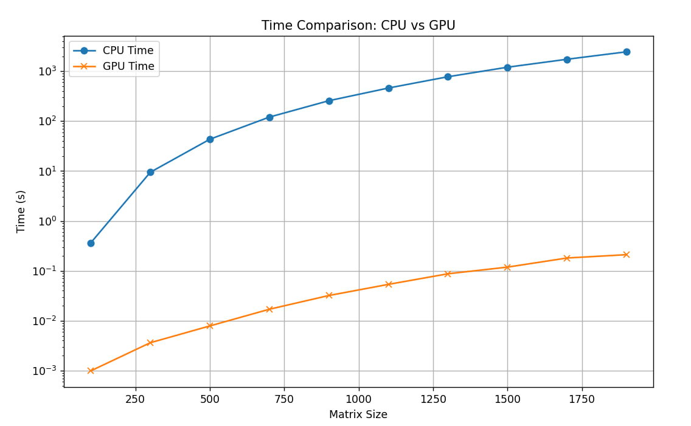
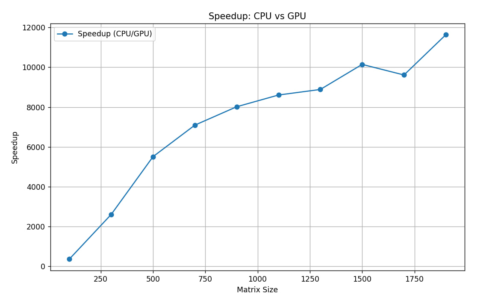

# Умножение матриц на GPU и CPU
Для CPU реализован классический наивный алгоритм умножения двух матриц поэлементно

Для GPU реализован алгоритм с использованием технологии CUDA и вставки Kernel функции на C++

Для обоих вариантов был произведен замер времени выполнения умножения матриц различных размерностей

Представлен график зависимости времени выполнения программы от размерности матриц для CPU и GPU соответственно

Представлен график зависимости ускорения от размерности матриц
__________________________________________________________
# Почему GPU намного быстрее CPU?
В ахитектуру GPU изначально была заложена возможность работы с матрицами.
GPU содержит много ядер, которые работают на низких частотах. Каждое такое ядро выполняет свою задачу параллельно с другими.

CPU наоборот, содержит несколько ядер, работающих на высоких частотах. Современные процессоры имеют от 2 до 64 ядер. Каждое ядро может выполнять одну или несколько операций одновременно.
__________________________________________________________
# def matrix_mult_cpu(m_a, m_b)
Умножение матриц на CPU. 
1) Принимает на вход 2 матрицы.
2) Проверяет их на соответствие внутренних разменостей.
3) Выполняет поэлементное умножение.
4) Вызывает встроенную функцию np.dot для проверки корректности результата.
5) Поэлементно сравнивает библиотечное умножение с результатом реализованного алгоритма.
6) Возвращает переменную типа bool и время выполнения умножения.
______________________________________________________________
# def matrix_mult_gpu_lib(m_a, m_b):
Умножение матриц на GPU. Библиотечная реализация с помощью функции cp.dot. 

При выполнении операций, таких как dot, CuPy запускает специальные кернелы на GPU, которые распараллеливают вычисления. 

1) Принимает на вход 2 матрицы.
2) Проверяет их на соответствие внутренних разменостей.
3) Переносит данные с CPU на GPU посредством функции cp.asarray()
4) Производит умножение посредством cp.dot()
5) Переносит данные с девайса на хост посредством cp.asnumpy()
6) Вызывает встроенную функцию np.dot для проверки корректности результата. 
7) Поэлементно сравнивает библиотечное умножение с результатом реализованного алгоритма. 
8) Возвращает переменную типа bool и время выполнения умножения.
__________________________________________________________________
# def matrix_mult_gpu(m_a, m_b):
Никаких библиотечных реализаций, только трушная kernel функция, оформленная в виде вставки на C++
1) Принимает на вход 2 матрицы.
2) Проверяет их на соответствие внутренних разменостей.
3) Задает размер блока, из которых будет состоять сетка. Dim указывает, сколько threads находится в одном блоке. Такой размер блока часто используется для обработки двумерных массивов.
4) grid_size вычисляет количество блоков необходимо для обработки всех столбцов матрицы m_b и всех строк матрицы m_a.
5) Заводит результирующую матрицу.
6) Выделяет для всех матриц память на GPU.
7) Переносит матрицы на GPU.
8) Вызывает kernel-функцию, которая выполняет поэлементное умножение.
9) Синхронизирует все потоки.
10) Результат переносит на CPU.
11) Проверяет на корректность. 
12) Возвращает переменную типа bool и время выполнения умножения.

