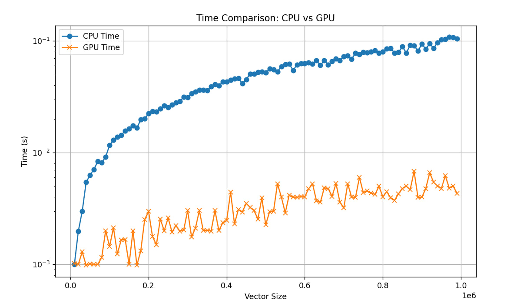

# Суммирование элементов вектора
Для CPU реализован классический алгоритм сложения элементов вектора

Для GPU реализован алгоритм с использованием технологии CUDA и вставки Kernel функции на C++

Для обоих вариантов был произведен замер времени выполнения сложения векторов различных размерностей

Представлен график зависимости времени выполнения программы от размерности вектора для CPU и GPU соответственно
__________________________________________________________
# Почему GPU намного быстрее CPU?
В ахитектуру GPU изначально была заложена возможность работы с матрицами.
GPU содержит много ядер, которые работают на низких частотах. Каждое такое ядро выполняет свою задачу параллельно с другими.

CPU наоборот, содержит несколько ядер, работающих на высоких частотах. Современные процессоры имеют от 2 до 64 ядер. Каждое ядро может выполнять одну или несколько операций одновременно.
__________________________________________________________
# def vector_sum_cpu(vector):
Суммирование элементов на CPU. 
1) Принимает на вход вектор.
3) Выполняет поэлементное суммирование. 
4) Возвращает результат сложения и время выполнения алгоритма.
______________________________________________________________
# def vector_sum_gpu_lib(vector)
Сумма элементов на GPU. Библиотечная реализация с помощью функции cp.sum. 

При выполнении операций, таких как sum, CuPy запускает специальные кернелы на GPU, которые распараллеливают вычисления. 

1) Принимает на вход вектор. 
2) Переносит данные с CPU на GPU посредством функции cp.asarray()
3) Производит сложение посредством cp.sum 
4) Переносит данные с девайса на хост посредством cp.asnumpy()
5) Возвращает результат сложения и время выполнения алгоритма.
_____________________________________________
# def vector_sum_gpu(vector)
Никаких библиотечных реализаций, только трушная kernel функция, оформленная в виде вставки на C++
1) Принимает на вход вектор. 
2) Задает размер блока, из которых будет состоять сетка. Dim указывает, сколько threads находится в одном блоке. 
3) grid_size вычисляет количество блоков необходимо для обработки вектора. 
4) Выделяет память на gpu с помощью cuda.mem_alloc. 
5) Переносит вектора на GPU. 
6) Вызывает kernel-функцию, которая складывает частичные суммы.
7) synchronize() заставляет CPU ждать, пока все запущенные на GPU задачи не завершатся. 
8) Результат переносит на CPU. 
9) Возвращает результат сложения и время выполнения алгоритма.

